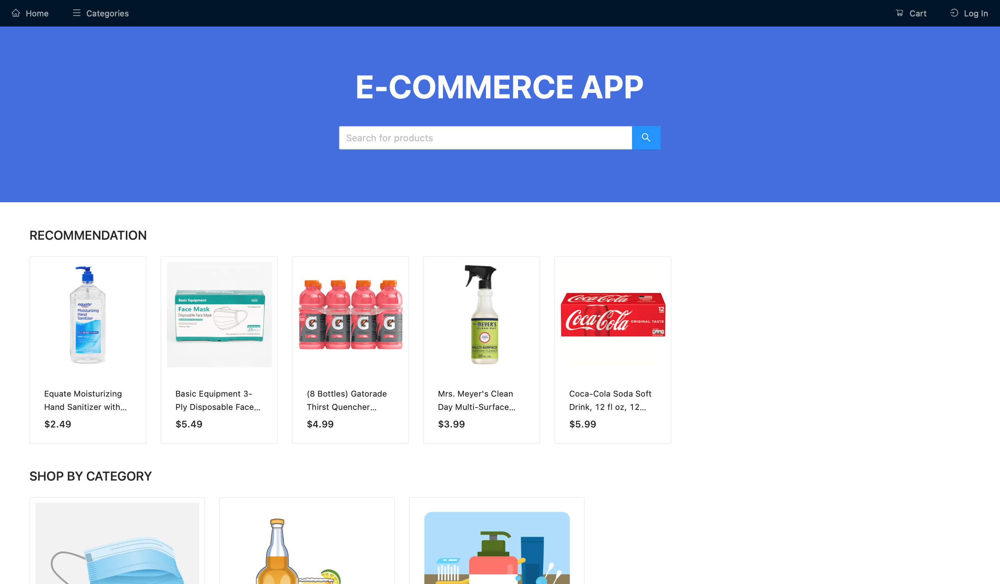

# React E-Commerce

## Overview
This is a fully functional e-commerce web application built using React. It provides users with a seamless shopping experience, including product browsing, adding items to the cart, and completing purchases.

## Features
- Product listing with search and filter functionality
- Shopping cart with item quantity adjustment
- User authentication and login/logout
- Order checkout process with order summary
- Responsive design for different screen sizes
- Wishlist functionality
- Admin dashboard for product and order management

## Demo


## Installation
To run this project locally, follow these steps:

### Prerequisites
Make sure you have the following installed on your system:
- [Node.js](https://nodejs.org/) (LTS version recommended)

### Steps
```sh
# Clone the repository
git clone https://github.com/xinyuwen23/react-e-commerce.git

# Navigate into the project directory
cd react-e-commerce

# Install dependencies
npm install

# Start the development server
npm start
```

Open your browser and visit `http://localhost:3000/` to explore the app.

## Usage
```md
- Browse the product catalog.
- Search and filter products.
- Add products to your shopping cart or wishlist.
- Adjust item quantities before checkout.
- Proceed to checkout and place an order.
- Log in to access personalized features.
- Admins can manage products and orders.
```

## Technologies Used
```md
- React
- Redux (for state management)
- React Router (for navigation)
- Styled Components / CSS
- Firebase / Express (if applicable for backend services)
```

## Future Improvements
```md
- Implement payment integration
- Enhance UI/UX with better animations and design
- Add user reviews and ratings
- Optimize performance for larger product catalogs
```

## Contributing
```md
Feel free to submit issues or pull requests to improve this project!
```

## License
```md
This project is licensed under the MIT License.
```

---
**Author:** [Xinyu Wen](https://github.com/xinyuwen23)

